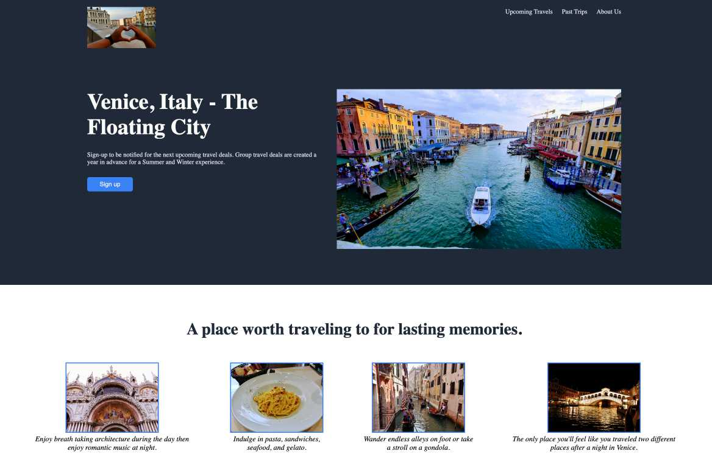

<!-- TABLE OF CONTENTS -->

  
Table of Contents

  <ol>
    <li>
      <a href="#about-the-project">About The Project</a>
      <ul>
        <li><a href="#built-with">Built With</a></li>
      </ul>
    </li>
    <li>
      <a href="#getting-started">Getting Started</a>
      <ul>
        <li><a href="#prerequisites">Prerequisites</a></li>
      </ul>
    </li>
    <li><a href="#contact">Contact</a></li>
  </ol>

 

<!-- ABOUT THE PROJECT -->
## About The Project

Here is a landing page project I created while working on The Odin Project's Foundations path. A fun project that allowed me to think of how to approach a layout using CSS Flexbox. I also used my own images from a past trip to Venice, IT! Oh the memories...

 

 

### Built With

* HTML
* CSS

 

<!-- GETTING STARTED -->
## Getting Started

Fork repo and open in code editor.

### Prerequisites
Web browser and code editor.

 

<!-- Areas to improve -->
## Areas to Improve
Here are my thoughts to improve this project with the knowledge I have to date and keep this built with only HTML and CSS. I would improve the responsiveness of the static page.  Since I recently started approaching projects with a mobile-first approach, I noticed my thought process has considerably change. 

I would work on adding media queries to adjust the layout for different viewport sizes.  I probably would update some Flexbox areas to Grid like in the lasting memories section.  Having work with Grid recently in some other projects I find that I have better control with placement of elements.  Lastly I would make more use of 'rem'/'em' instead of 'px'.

I'm sure there are more areas to improve, but for this project the goal at the time was focusing on layout and Flexbox.  Please send me any comments of your thoughts as I know there are so much of CSS yet to explore!

<!-- CONTACT -->
## Contact

Chris Salvador - [@const_Salvador](https://twitter.com/const_salvador)

Project Link: [https://github.com/csalvador58/odin-landing-page](https://github.com/csalvador58/odin-landing-page)

 

(<a href="#readme-top">back to top</a>)

